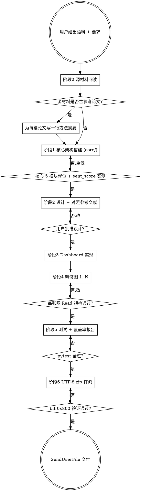

# BERT 情感分析可视化交付包 · 通法

> **执行者守则**：本 skill 是**双层结构**——主干为通用方法骨架（适用于任何 BERT 多分类情感语料 + 可视化交付包），下层是 `tang-poetry-reference/` 唐诗实例附录展示参数怎么填。每一节末尾用「→ 唐诗例」链接到对应附录。
>
> **何时启动**：用户给一份"已用 BERT 类模型打过情感标签的文本语料"+"要求交付一个完整可视化包"+"作业/汇报性质"时。典型信号：教师 zip / 原生脚本 / 附带参考论文 / 期望 dashboard + 多图 + 设计说明。

## 总览

本 skill 把一次"从 sentiment.csv 到完整提交包"的复杂工程切成 **6 个不可跳过的阶段**，每个阶段都有自己的产物、红线、自检点。任一阶段失败必须停止重规划，绝不带着已知缺口推进。

```
[阶段0] 源材料阅读        →  生成「已读清单 + 关键约束记录」
[阶段1] 核心架构搭建      →  core/ 5 模块 + 一次性 sent_score 计算
[阶段2] 设计与对齐参考文献 →  设计说明.md 骨架 + 「对照参考文献」章节
[阶段3] Dashboard 实现    →  1 张 A3 主图（≥ 8 面板 GridSpec）
[阶段4] 精修图实现        →  N 张独立 PNG（每张对应 dashboard 一个面板的放大）
[阶段5] 测试与视检        →  pytest + 逐张图 Read 确认 + 覆盖率报告
[阶段6] 打包提交          →  UTF-8 zip（设计说明 + 代码/ + 图片/）
```

## 工作流程图



---

## 阶段 0 · 源材料阅读（必做，不可跳过）

**目标**：把用户提供的所有源材料（教师 zip / 原生脚本 / PDF / 参考论文）**全部读完**，提取约束。

**为什么**：用户常常只在源材料里隐式表达约束（教师 PPT 第 X 页用了某种图、参考论文用了某种方法）。跳过等于把作业做偏。

**checklist**：
- [ ] 教师 zip 全部解压并列出内部所有文件，逐个 Read
- [ ] PDF（任务书、课件）逐页 Read，提取分值分布、要求清单
- [ ] 参考论文 zip 全部解压；对每篇 PDF 至少读首页 abstract + 方法节 + figure 列表
- [ ] 原始数据 CSV / JSON 字段全部 Read（确认 sent_score 怎么算、列名是什么）
- [ ] **为每份材料写一行摘要**到 `_source_notes.md`：「文件名 → 关键约束 1 句」

**红线**：
- **不可**仅凭 zip 文件名猜内容
- **不可**只读论文标题不读方法节
- 教师代码里出现的图（如原生 pie 图）**必须保留**在最终交付，因为这是教师"已认证"的正确产物

→ 唐诗例：`tang-poetry-reference/01-source-materials.md`

---

## 阶段 1 · 核心架构搭建（`core/`）

**目标**：一套**只在数据载入时算一次**的核心工具模块，避免每张图重复计算。

### 1.1 模块切分（5 个文件，每个职责单一）

| 文件 | 唯一职责 | 关键导出 |
|---|---|---|
| `core/palette.py` | 颜色 + 字体常量 | `PALETTE_5_LIST`、`get_font_prop(role, size, weight)`、`WEIGHTS=[-2,-1,0,1,2]`、`PROB_COLS` |
| `core/theme.py` | 一键应用 matplotlib rcParams | `apply_ancient_theme()` |
| `core/data_loader.py` | CSV → DataFrame + 加权情感分 + 衍生统计 | `load_poems(csv)`、`poet_stats(df)`、`text_features(df)`、`extreme_poems(df, n)`、`STOPWORDS` |
| `core/dynasty.py`（或 `category_map.py`） | 离散标签映射（如诗人→朝代） | `DYNASTY_MAP`、`get_dynasty(name)`、`coverage_report(names)` |
| `core/poet_birthplace.py`（或 `entity_geo.py`） | 实体→坐标映射（如诗人→籍贯） | `BIRTHPLACE_MAP`、`get_birthplace(name)` |

**红线**：**不可**让 extras/ 各图自己重算 sent_score、字频、朝代分类。算一次，挂在 DataFrame 上传给所有图。

### 1.2 加权情感分（核心公式，不可替换为 argmax）

```python
# data_loader.py
probs = df[PROB_COLS].to_numpy(dtype=float)
df["sent_score"] = probs @ np.array(WEIGHTS, dtype=float)   # WEIGHTS=[-2,-1,0,1,2]
df["sent_confidence"] = probs.max(axis=1)
df["char_count"] = df["内容"].apply(lambda s: len(_strip_to_chinese(s)))
```

**为什么不能 argmax**：argmax 丢失"勉强 Neg"和"极端 Neg+"的差异，使热力图/地图/曲线退化为离散块。加权分是 ∈ [-2,+2] 的连续标量，喂给任何标量映射（colormap / 等高线 / 折线）都自然。

### 1.3 字体 5 级降级（跨机器必备）

```python
FONT_CANDIDATES_TITLE = [
    r"C:\Windows\Fonts\STLITI.TTF",     # 华文隶书（首选）
    r"C:\Windows\Fonts\STXINWEI.TTF",   # 华文新魏
    r"C:\Windows\Fonts\STKAITI.TTF",    # 华文楷体
    r"C:\Windows\Fonts\simkai.ttf",     # 楷体
    r"C:\Windows\Fonts\simhei.ttf",     # 黑体（兜底）
]

def pick_font(candidates):
    for p in candidates:
        if Path(p).exists():
            return p
    return None
```

**红线**：**不可**硬编单个字体路径——别人机器没装会全部退回默认 sans-serif，中文变方框。

### 1.4 离散映射的覆盖率自检

```python
def coverage_report(names) -> dict:
    covered = [n for n in names if n in MAP]
    missing = sorted(set(names) - set(MAP.keys()))
    return {"total": len(set(names)), "covered": len(set(covered)),
            "coverage_rate": ..., "missing": missing}

# core/dynasty.py 的 __main__ 直接跑覆盖率，看到 < 100% 立刻补条目
```

**红线**：覆盖率 < 100% 但有"无名氏/不详"这类合理未覆盖时，必须显式标为"未细分"分类，**不可**默默丢弃。

→ 唐诗例：`tang-poetry-reference/02-core-modules.md`

---

## 阶段 2 · 设计与对照参考文献

**目标**：用 `superpowers:brainstorming` skill 收敛设计 → 用 `superpowers:writing-plans` 写实施计划 → 设计说明.md 直接写出「对照参考文献」章节。

### 2.1 设计说明骨架（4 个固定章节）

```
一、作品说明        ← 文件清单表 + 总体风格描述
二、算法说明        ← 加权分公式 + 离散映射策略 + 文本处理
三、阅读指南        ← Dashboard 入口 + N 张精修图各自看点
四、对照参考文献    ← 必须！每篇论文写：方法 / 借鉴点
```

模板见 `design-doc-template.md`。

### 2.2 对照参考文献（必打章节）

每篇论文按下列三段式写：

```markdown
### Paper X · <论文标题简称>

**方法**：<一句话方法概要>
**本作业借鉴**：
- <借鉴点 1>（→ 对应到本作业 0X 号图 / 某个公式）
- <借鉴点 2>
```

**红线**：
- **不可**只列论文标题不说怎么借鉴
- **不可**借鉴而不在设计说明里 cite——评分老师无从知道你读过
- 论文方法 ↔ 本作业图的对应关系必须**双向可查**（论文 → 图，图 → 论文）

模板见 `paper-alignment-template.md`。

### 2.3 与用户对齐设计

按 `superpowers:brainstorming` skill 流程：
1. 先列 2-3 种候选方案 + 推荐
2. 用户选定后写 design doc 到 `docs/superpowers/specs/YYYY-MM-DD-<topic>-design.md`
3. **用户必须批准** design doc 后才能进 plan-writing
4. plan 写到 `docs/superpowers/plans/YYYY-MM-DD-<topic>.md`

→ 唐诗例：`tang-poetry-reference/03-design-doc.md`

---

## 阶段 3 · Dashboard 实现

**目标**：一张 A3 横版多面板主图，把所有维度浓缩展示。

### 3.1 画布与栅格

```python
# A3 横版 @300dpi
fig = plt.figure(figsize=(16.5, 11.7), dpi=300)   # → 4961 × 3508
gs = GridSpec(N_ROWS, N_COLS, figure=fig,
              hspace=..., wspace=...,
              height_ratios=[...], width_ratios=[...])
```

### 3.2 必有面板（按行从上到下）

| 行 | 面板 | 用途 |
|---|---|---|
| A | 印章式标题 | 项目名 + 副标 + 模型/工具角标 |
| B | KPI 卡片条（5 张 FancyBboxPatch） | 关键数字一眼看全 |
| C | 主视觉（左饼/中色谱/右雷达 三联） | 分布 + 排序流 + Top 实体画像 |
| D | 二级面板（实体排名条 + 词云缩略） | 中等密度信息 |
| E | 时间/地理维度图（Sankey 或 时间曲线） | 跨期/跨地比较 |
| F | 极端样本双栏 Top 5 | 让人能文学/语义层面验证模型 |

### 3.3 印章式标题（中文风格必备）

```python
seal = FancyBboxPatch((0.01, 0.15), 0.07, 0.7,
    boxstyle="round,pad=0.005,rounding_size=0.015",
    facecolor=PALETTE_5["Pos Plus"],   # 朱砂
    edgecolor=TEXT_TITLE, linewidth=1.5,
    transform=ax.transAxes)
ax.add_patch(seal)
ax.text(0.045, 0.5, "<两行项目名>",
    fontproperties=get_font_prop("title", 18, weight="bold"),
    color="white", ha="center", va="center",
    transform=ax.transAxes, linespacing=0.9)
```

→ 唐诗例：`tang-poetry-reference/04-dashboard-spec.md`

---

## 阶段 4 · 精修图实现

**目标**：N 张 ≥ 3600×2400 @300dpi 的独立 PNG，每张对应 dashboard 的一个面板的"无压缩放大版"。

### 4.1 N 张精修图的最低基础组合（按推荐顺序）

| 编号 | 图名 | 算法基础 | 复刻自论文 |
|---|---|---|---|
| 01 | 情感分布环形图 | 5 类计数 → Wedge | — |
| 02 | 实体 × 情感热力图 | poet_cross 交叉表 | Paper 1 actor profile |
| 03 | 词云 | text_features 高频字+bigram | — |
| 03b | 5 子情感词云拼图 | 按情感分类 5 份语料 | — |
| 04 | 朝代/分组 Sankey | dynasty × sentiment 流量 | — |
| 05 | 时间曲线 + 重大事件阴影 | 4 朝代均值 ± std + axvspan | Paper 2 lockdown trajectory |
| 06 | 实体地理分布图 | birthplace 散点 + 手绘底图 | Paper 3 地理维度 |
| 07 | 关键 n-gram 历时演变曲线 | freq/total×1000 | **Paper 3 Diachronic n-gram** |
| 08 | 高频字共现网络 | spring_layout 力导向 | **Paper 3 Word co-occurrence** |

**红线**：07/08 是 Paper 3 直接复刻，**不可**省略，否则「对照参考文献」章节会变成空头支票。

### 4.2 每张精修图的统一模板

```python
"""独立精修图 0N · <图名>（3600×2400 @300dpi）

对标 <参考论文/PPT 来源> 的 <方法名>
视觉要点：<逐条列>
归一化公式（若有）：<公式>
"""
import sys
from pathlib import Path
sys.path.insert(0, str(Path(__file__).parent.parent))

from core import palette as P
from core import theme
from core import data_loader as DL
# 按需 import 离散映射 / 地理

def render(df, output_path: Path):
    theme.apply_ancient_theme()
    fig, ax = plt.subplots(figsize=(12, 8), dpi=300)
    fig.patch.set_facecolor(P.BACKGROUND)
    ax.set_facecolor(P.BACKGROUND)

    # ... 主体绘图 ...

    # 标题 (fig.text 而非 ax.set_title 以独立控制位置)
    fig.text(0.5, 0.97, "<中文主标题>",
        fontproperties=P.get_font_prop("title", 22, weight="bold"),
        color=P.TEXT_TITLE, ha="center", va="top")
    fig.text(0.5, 0.93, "<English Subtitle> (method ref: <Paper>)",
        fontproperties=P.get_font_prop("body", 11), style="italic",
        color=P.TEXT_NOTE, ha="center", va="top")

    # Footer 含 insight（必须有数字结论）
    fig.text(0.5, 0.02, "<数据来源 + Top N 结论 + 方法注>",
        fontproperties=P.get_font_prop("body", 8),
        color=P.TEXT_NOTE, ha="center", va="bottom")

    fig.savefig(output_path, dpi=300, bbox_inches="tight",
                facecolor=P.BACKGROUND, pad_inches=0.3)
    plt.close(fig)

if __name__ == "__main__":
    csv = Path(__file__).parent.parent / "data" / "<corpus>_with_sentiment.csv"
    out = Path(__file__).parent.parent / "outputs" / "0N_<图名>.png"
    df = DL.load_poems(csv)
    render(df, out)
    print(f"[OK] saved {out} ({out.stat().st_size // 1024} KB)")
```

### 4.3 连续情感分映射（colormap）

```python
import matplotlib.colors as mcolors
cmap = mcolors.LinearSegmentedColormap.from_list("sent", P.PALETTE_5_LIST, N=256)
norm = mcolors.Normalize(vmin=-2.0, vmax=2.0)
# 取色：cmap(norm(sent_score_value))
```

**红线**：**vmin/vmax 必须固定为 -2.0/+2.0**，不能用 df.min/df.max——否则不同图之间颜色不可比。

### 4.4 同坐标抖动（地图图必备）

```python
def jitter_same_point(records):
    """同坐标 (lat, lon) 的实体沿圆均布；半径随密度增加。"""
    bucket = {}
    for r in records:
        key = (round(r["lat"], 2), round(r["lon"], 2))
        bucket.setdefault(key, []).append(r)
    out = []
    for _, group in bucket.items():
        n = len(group)
        if n == 1:
            out.append(group[0]); continue
        radius = 0.30 + 0.05 * n     # 1° ≈ 110 km
        for i, r in enumerate(group):
            theta = 2 * math.pi * i / n
            r2 = dict(r)
            r2["lat"] += radius * math.sin(theta)
            r2["lon"] += radius * math.cos(theta)
            out.append(r2)
    return out
```

### 4.5 共现网络的固定参数

```python
import networkx as nx
G = build_graph(df, top_n=30, min_edge_count=5)
pos = nx.spring_layout(G, k=1.2, iterations=200, seed=42, weight="weight")
# seed=42 必须固定，否则每次重画位置都不一样
```

### 4.6 历时 n-gram 的归一化公式

```
freq_norm(意象, 时段) = count(意象 in 时段语料) / total_chars(时段) × 1000
```

每千字频次。**红线**：必须归一化，否则盛唐诗多就压死其他时期。

→ 唐诗例：`tang-poetry-reference/05-figures-01-to-08.md`

---

## 阶段 5 · 测试与视检

### 5.1 pytest 单元测试（至少 3 个测试文件）

```
tests/test_palette.py     ← 字体路径解析、5 色列表长度
tests/test_data_loader.py ← sent_score 范围、列名、覆盖率
tests/test_dynasty.py     ← 离散映射覆盖率 100% 或显式未覆盖白名单
```

**红线**：pytest 全部通过才能进打包阶段。

### 5.2 视检（必做，不可省）

每张 PNG 渲染完用 **Read 工具**读取一次确认：
- 中文是否全部正常显示（无方框）
- colormap 方向是否正确（负值冷 / 正值暖）
- 标题、副标、Footer、图例、坐标轴全部齐全
- 数字 footer 的结论是否与 stdout 打印的一致

**红线**：**不可**只看到脚本 `[OK] saved` 就声称完成。matplotlib 静默失败的常见症状是中文方框、coverage 缺失、colormap 颠倒——脚本不会报错，只有视检能发现。

→ 检查清单：`checklist.md`

---

## 阶段 6 · 打包提交

### 6.1 zip 结构（固定）

```
作业N_<topic>_提交.zip
├── 设计说明.md
├── 代码/
│   ├── dashboard.py
│   ├── core/         （所有 *.py + __init__.py）
│   ├── extras/       （01-N 精修图 + __init__.py）
│   └── tests/        （test_*.py + __init__.py）
└── 图片/
    ├── 00_<dashboard>.png
    ├── 01_<...>.png ... 0N_<...>.png
    ├── 原生_<教师脚本产物>.png   ← 阶段 0 提取的"已认证"产物
    └── 原生_<教师脚本产物>.csv
```

### 6.2 UTF-8 文件名陷阱（Windows 必修）

Python `zipfile` 写中文文件名时**必须**带 UTF-8 标志位（bit 0x800），否则别的机器解压会乱码。

```python
import zipfile

manifest = [(src_abs, dst_in_zip), ...]   # 显式 (源, 内部路径) 双元组

with zipfile.ZipFile(out_zip, "w", zipfile.ZIP_DEFLATED, compresslevel=6) as z:
    for src, dst in manifest:
        if not src.exists():
            print(f"[MISS] {src}"); continue
        z.write(src, arcname=dst)
        print(f"[+] {dst}  ({src.stat().st_size // 1024} KB)")
```

**验证**：

```python
with zipfile.ZipFile(out_zip) as z:
    bad = [zi.filename for zi in z.infolist() if not (zi.flag_bits & 0x800)]
    assert not bad, f"非 UTF-8 文件名: {bad}"
```

**红线**：bit 0x800 未通过验证**不可**发给用户。

### 6.3 交付

```python
SendUserFile(
    files=["<abs path to zip>"],
    status="proactive",
    caption=f"最终提交包 {size_mb} MB · {n_files} 文件（设计说明 + 代码 + 图片）",
)
```

→ 打包模板与陷阱：`packaging.md`

---

## 终局自检（在 SendUserFile 前必须完整跑过）

读 `checklist.md` 逐项打钩。任何一项未过**绝不**发出最终交付。

最常见漏项（按出现频率排序）：
1. 设计说明里「对照参考文献」章节为空 / 占位
2. 教师原生脚本产物（如 pie 图 / 统计 csv）没打进 zip
3. 视检发现中文方框（字体降级未触发）
4. pytest 没真跑，靠记忆声称通过
5. zip 文件名 bit 0x800 未验证
6. 07/08 历时/共现图未做（Paper 3 借鉴 = 空头支票）
7. colormap vmin/vmax 用了 df 实测值而非固定 [-2, +2]
8. 覆盖率报告里有未解释的缺失实体

## 反模式（绝不做）

- ❌ 跳过阶段 0 直接动手写图
- ❌ 每张图各自重算 sent_score
- ❌ 用 argmax 替代加权情感分
- ❌ 字体硬编路径不做降级
- ❌ 看到脚本 `[OK]` 就声称完成而不视检 PNG
- ❌ 「对照参考文献」章节只列论文标题不说怎么借鉴
- ❌ 历时分析不做归一化（直接用原始 count）
- ❌ 共现网络不固定 seed
- ❌ 把教师原生产物从最终交付里删掉
- ❌ 不验证 UTF-8 bit 直接发 zip

## 关联 skill

- **必先用**：`superpowers:brainstorming`（阶段 2 设计）
- **必先用**：`superpowers:writing-plans`（阶段 2 末出 plan）
- **推荐**：`superpowers:subagent-driven-development`（阶段 3-4 多张图分派 subagent）
- **不要用**：cartopy / geopandas（阶段 4.4 地图改用手绘 polygon，依赖更轻）

## 附录文件清单

主干文档：
- `SKILL.md` ← 本文件
- `checklist.md` ← 6 阶段终局自检
- `code-architecture.md` ← core/ 5 模块详细模板
- `visual-aesthetic.md` ← 5 色 + 字体 + colormap 规范
- `design-doc-template.md` ← 设计说明.md 完整骨架
- `paper-alignment-template.md` ← 对照参考文献章节模板
- `packaging.md` ← UTF-8 zip 打包细节

唐诗实例附录（双层结构下层）：
- `tang-poetry-reference/01-source-materials.md`
- `tang-poetry-reference/02-core-modules.md`
- `tang-poetry-reference/03-design-doc.md`
- `tang-poetry-reference/04-dashboard-spec.md`
- `tang-poetry-reference/05-figures-01-to-08.md`
